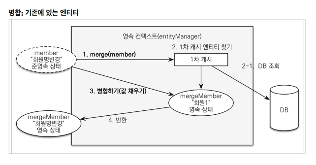

## 7. 웹 계층 개발

### 7.1 홈 화면과 레이아웃

> 201018 (Sun)

* Pass


---

### 7.2 회원 등록

> 201018 (Sun)

* Pass

---


### 7.3 회원 목록 조회

> 201018 (Sun)

* Pass

---


### 7.4 상품 등록

> 201018 (Sun)

* Pass

---


### 7.5 상품 목록

> 201018 (Sun)

* Pass

---


### 7.6 상품 수정

> 201018 (Sun)

* Pass

---

### 7.7 변경 감지와 병합(merge)

> 201018 (Sun)

<h2> 준영속 엔티티 </h2>

* 영속성 컨텍스트가 더는 관리하지 않는 엔티티를 말한다.

* 준영속 엔티티를 수정하는 2가지 방법

---

1. 변경 감지 기능 사용

2. 병합(merge) 사용

---

> 1. 변경 감지 기능 사용

``` java
@PersistenceContext
private EntityManager em;

@Transactional
void update(Item itemParam) { // [1] 
    Item findItem = em.find(Item.class, itemParam.getId()); // [2] 
    findItem.setPrice(itemParam.getPrice()); // [3] 
}
```

* [1] : Parameter로 넘어온 준영속 상태의 엔티티(= itemParam)

* [2] : 같은 엔티티를 조회한다. 

  왜냐하면 조회한 엔티티는 영속 상태의 엔티티이기 때문이다.

* [3] : 데이터를 수정한다. 

  그리고 트랜잭션 커밋 시점에 변경 감지(Dirty Checking)을 하여 Update SQL을 실행시켜준다.


---

> 2. 병합(merge) 사용



``` java
@PersistenceContext
private EntityManager em;

@Transactional
void update(Item itemParam) { // [1]
    Item mergeItem = em.merge(item); // [2]
}
```

* [1] : Parameter로 넘어온 준영속 상태의 엔티티(= itemParam)

* [2] : 내부적으로 기존 엔티티를 조회 후 모든 값을 Parameter로 받은 itemParam으로 변경한다.

  모든 값을 변경하므로 매우 위험한 액션이다.

<br>

* 병합(merge)시 동작 방식을 정리하자면 다음과 같다.

1. 준영속 엔티티의 식별자 값으로 영속 엔티티를 조회한다.

2. 영속 엔티티의 값을 준영속 엔티티의 값으로 모두 교체한다.(병합한다.)

3. 트랜잭션 커밋 시점에 변경 감지 기능이 동작해서 데이터베이스에 Update SQL이 실행된다..

---

> 주의할 점

* **변경 감지 기능**을 사용하면 원하는 속성만 선택해서 변경할 수 있지만 

  병합을 사용하면 **모든 속성**이 변경된다. 
  
  즉 병합시 값이 없으면 null 로 업데이트 할 위험도 있다. 
  
  (= 병합은 모든 필드를 교체한다.)


---


### 7.8 상품 주문

> 201018 (Sun)

* Pass

---


### 7.9 주문 목록 검색, 취소

> 201018 (Sun)

* Pass

---


