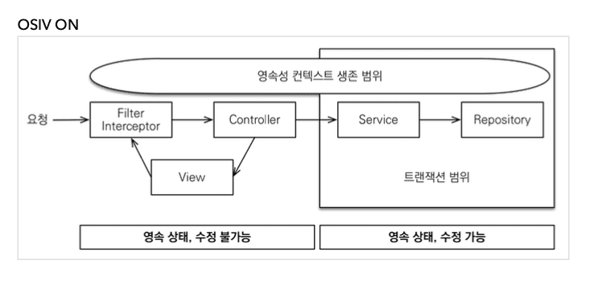

## 5. API 개발 고급 - 실무 필수 최적화

### 5.1 OSIV와 최적화

> 210226 (Fri)

> OSIV = true

* 영속성 컨텍스트가 언제 DB 커넥션을 가져올까?

  기본적으로는 DB Transaction 시작 시 가져온다.

* 그렇다면 언제 커넥션을 반환할까?

  API 응답이 끝날 때 반환한다.

* 그러므로 지금까지 API 응답이 반환되기 전까지는

  **지연 로딩**이 가능했다.

* 이 부분이 OSIV의 장점이자 단점이 되는 포인트이다.

  말 그대로 커넥션을 너무 오랫동안 갖고 있으므로 

  실시간 트래픽이 중요한 어플리케이션에서는 커넥션 부족이 발생할 수 있다.

---

> OSIV = false

* OSIV가 false 이면 Transaction 종료 시 

  영속성 컨텍스트를 닫고 커넥션도 반환을 한다.

  따라서 커넥션 리소스를 낭비하지 않는다.

* 그러므로 모든 **지연 로딩**을 Transaction 안에서 처리해야 한다.

  그래서 Transaction 밖에서 사용한 지연 로딩 코드를

  Transaction 안으로 넣어야 하는 **단점**이 생긴다.

  즉 Transaction 안에서 지연 로딩을 강제로 호출해 두어야지 

  Transaction 밖에서 정상적으로 데이터를 참조할 수 있게 된다.

* 아니면 fetch join으로 DB에서 데이터를 조회하는 타이밍에 다 갖고 오도록 한다

---

> 참고

* 영한님은 고객 서비스의 실시간 API는 OSIV를 끄고 

  ADMIN 처럼 커넥션을 많이 사용하지 않는 곳에 서는 OSIV를 켠다.

---

## Summary

* 210226 (Fri)

  다시 들을 필요는 없다.

  위 내용이 전부다.