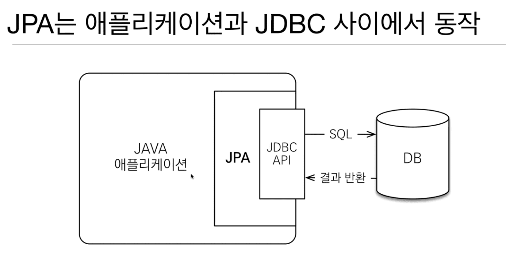
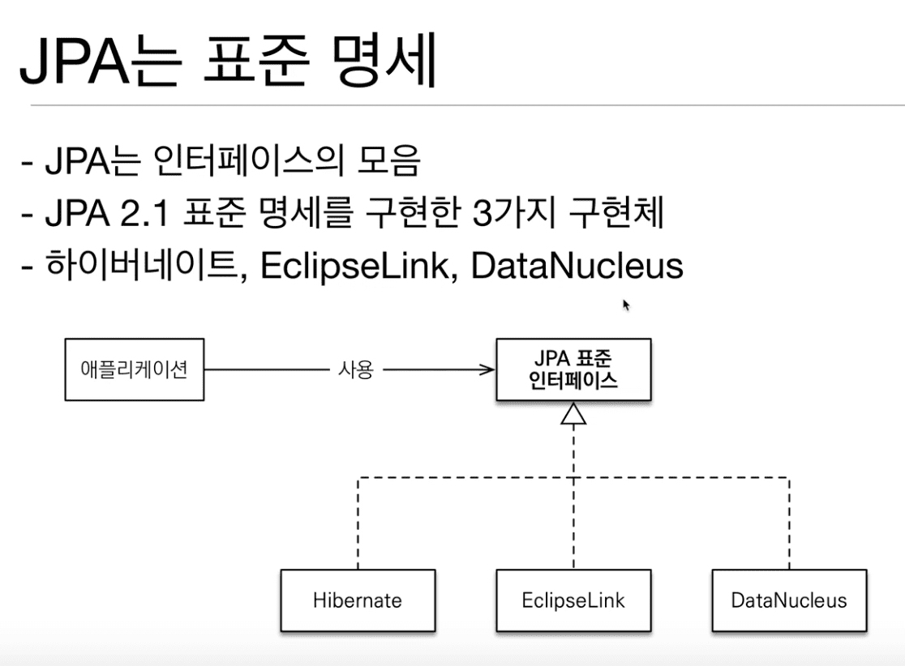

## 1. JPA 소개

### 1.1 SQL 중심적인 개발의 문제점

> 201001 (Thu)

* Pass

---

### 1.2 JPA 소개

> 201001 (Thu)

* JPA

  Java 진영에서 **ORM** 기술 표준

* 개발자가 직접 JDBC Api를 사용하지 않아도 된다.

* JPA는 인터페이스이고 

  구현체가 하이버네이트