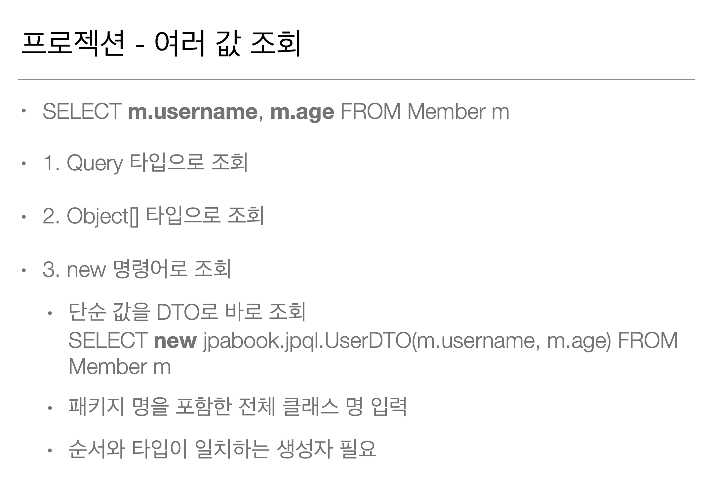

## 10. 객체지향 쿼리 언어1 - 기본 문법

### 10.1 소개

> 201003 (Sat)

* JPQL이라는 표준 문법이 있다.

  ( JPQL = 객체 지향 쿼리 언어 )

* JPQL = Entity 객체를 대상으로 쿼리

  SQL = DB Table을 대상으로 쿼리

* JPA Criteria / QueryDSL는

  JPQL을 빌드해주는 Generater이다.

 

> Criteria

* 실무에서 쓰지마라.

  너무 복잡하고 실용성이 없다.

* SQL스럽지 않다.

 

> QueryDSL

* Open Source Library이다.

---

### 10.2 기본 문법과 쿼리 API

> 201003 (Sat)

* Pass

---

### 10.3 프로젝션(SELECT)

> 201003 (Sat)

---

### 10.4 페이징

> 201003 (Sat)

* Pass

---

### 10.5 조인

> 201003 (Sat)

* Pass

---

### 10.6 서브 쿼리

> 201003 (Sat)

* JPA 서브 쿼리 한계

    - JPA에서는 WHERE, HAVING 절에서만 서브 쿼리 사용이 가능하다.

      = SELECT 절에서는 사용이 불가능하다.

      = FROM 절에서는 사용이 불가능하다.

    - 하이버네이트에서는 SELECT 절에서도 서브 쿼리 사용이 가능하다.

      그러므로 JPA 구현체로 하이버네이트를 사용하니까 SELECT에서도 사용이 가능하다고 볼 수 있다.

    - 그런데 JPQL에서 FROM 절의 서브 쿼리를 지원하지 않으므로 

      FROM 절의 서브 쿼리는 사용이 불가능하다.

      이 한계는 조인으로 풀 수 있으면 풀어서 해결해야한다.

      그것도 안되면 Native SQL을 사용해라.
    
---

### 10.7 JPQL 타입 표현과 기타식

> 201003 (Sat)

* Pass

---

### 10.8 조건식(Case 등등)

> 201003 (Sat)

* Pass

---

### 10.9 JPQL 기본 함수

> 201003 (Sat)

* Pass
