## 11. 객체지향 쿼리 언어2 - 중급 문법

### 11.1 경로 표현식

> 201003 (Sat)

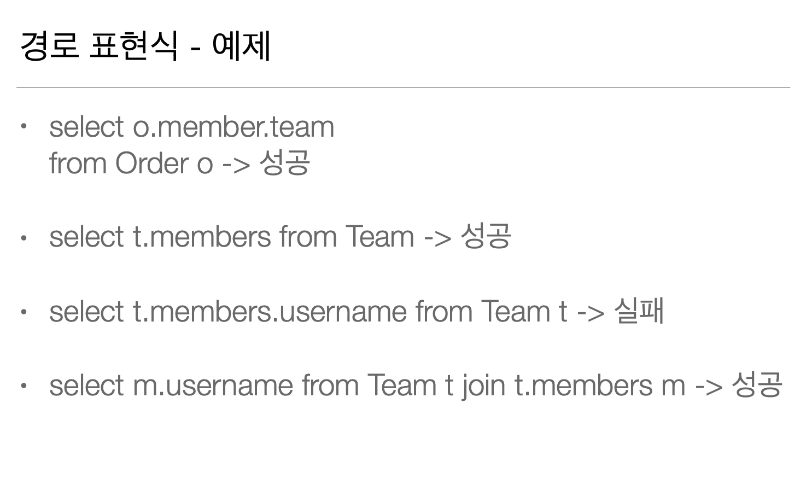

> 경로 탐색을 사용한 묵시적 조인 시 주의사항

* 항상 내부 조인이 일어난다.

* 컬렉션은 경로 탐색의 끝이다.

  더이상 탐색이 안된다.

  추가적인 경로 탐색을 하고 싶다면 명시적 조인을 통해 별칭을 얻어야 한다.

> 결론

* 명시적 조인만 사용해라 !


---


### 11.2 패치 조인 1 - 기본

> 201004 (Sun)

* Fetch Join으로 N + 1 문제를 해결한다.

* 중요한 내용이다.

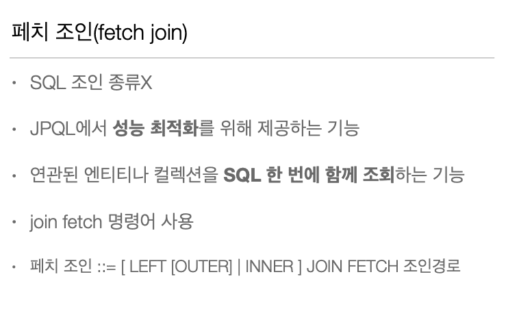

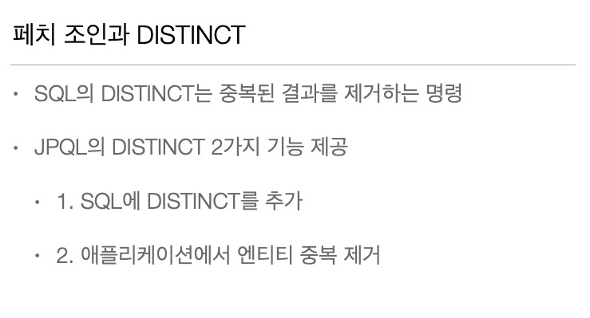

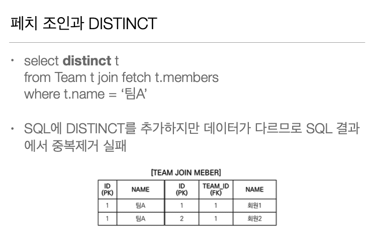

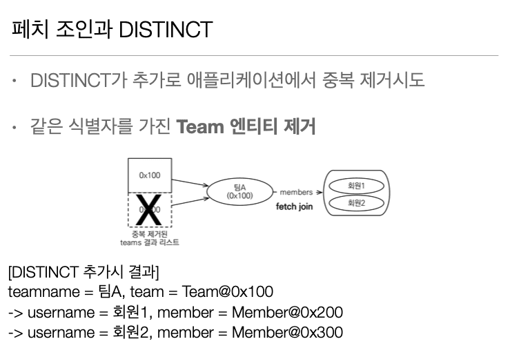

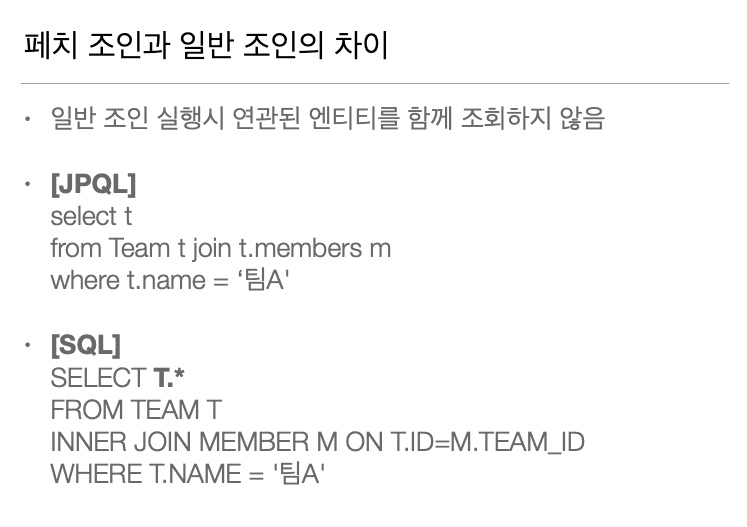

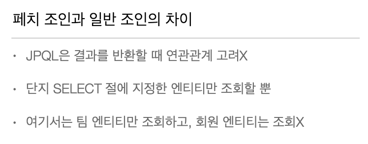


---

### 11.3 패치 조인 2 - 한계

> 201004 (Sun)

* 뭔가 와닿지 않았다.

  아직 사용해본 경험이 없어서 그런가...

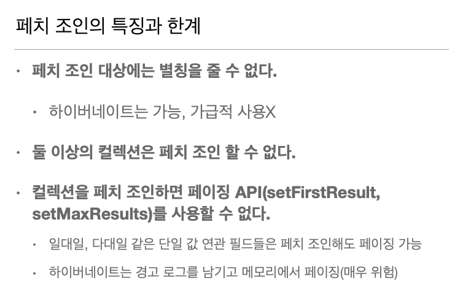

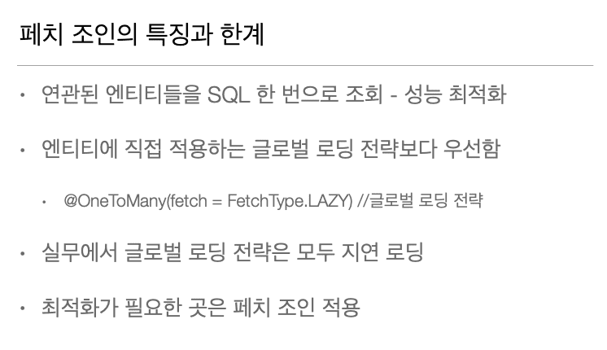

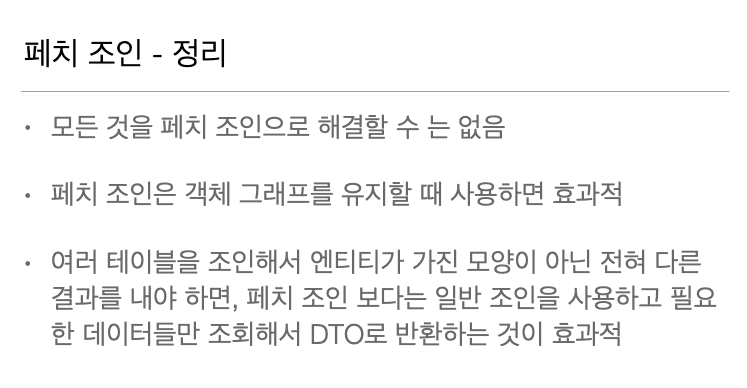

---

### 11.4 다형성 쿼리

> 201004 (Sun)

* Pass 

---

### 11.5 엔티티 직접 사용

> 201004 (Sun)

* Pass 

---

### 11.6 Named 쿼리

> 201004 (Sun)

* 미리 정의해서 이름을 부여해두고 사용하는 JPQL이다.

* 정적 쿼리이다.

* Annotation 혹은 XML에 정의한다.

  우선순위는 XML이 더 높다.

* 애플리케이션 로딩 시점에 초기화 후 재사용한다.
 
  그러므로 애플리케이션 로딩 시점에 쿼리 검증이 가능하다.

* Spring JPA에서 @Query가 Named 쿼리이다.

---

### 11.7 벌크 연산

> 201004 (Sun)

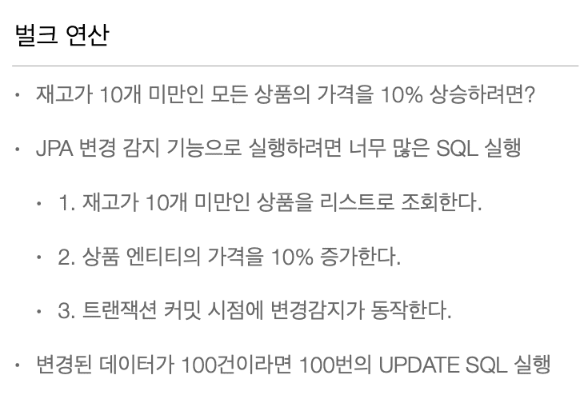

<br>

* 벌크 연산은 영속성 컨텍스트를 무시하고 DB에 직접 요청한다. (04:20)

* 사용하려면 다음과 같이 사용하자.

1. 벌크 연산을 먼저 수행

2. 벌크 연산 수행 후 영속성 컨텍스트 초기화

   벌크 연산 수행을 하면 기존에 영속성 컨텍스트에 있는 쿼리는 자동으로 flush가 된다.

> 2번 부연 설명

``` 
처음에 생성 시 age값은 없다.
이 Entity가 영속성 컨텍스트에 존재한다.
벌크 연산으로 실제 DB에 age값을 수정한다.
이 상태에서 조회를 하면 1차 캐시에 있는 Entity가 반환되면서 
DB와의 정합성이 깨진다.
그러므로 영속성 컨텍스트 초기화를 해줘야한다.
```


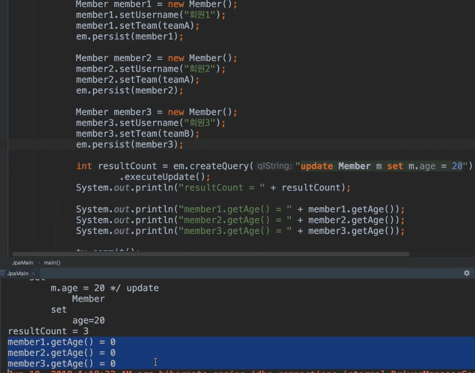

* 해당 예제는 벌크 연산 후 DB에 실질적으로 값이 변경되었지만

  영속성 컨텍스트에 있는 데이터와는 정합성이 깨지는걸 보여준다.
