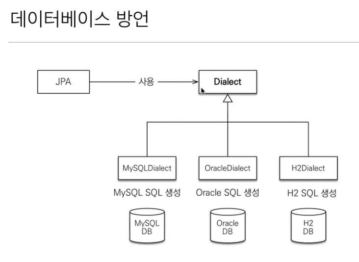

## 2. JPA 시작하기

### 2.1 Hello JPA - 프로젝트 생성

> 201001 (Thu)

* [H2 DB](http://www.h2database.com/html/main.html) 설치

* 라이브러리 추가 (7:44)

* JPA 설정하기 - persistence.xml (12:30)

  - 위치가 중요하다.

  - META-INF/persistence.xml

* DB Dialect 설명 (16:00)

---

### 2.2 Hello JPA - 애플리케이션 개발

> 201001 (Thu)

* raw한 JPA 사용법 (= without Spring Frameworkd)

  - 생성한 persistence.xml을 사용하는 방법

* JPA 사용 주의점 (19:25)

  - 엔티티 매니저 팩토리는 하나만 생성해서 애플리케이션 전체에 서 공유

  - 엔티티 매니저는 쓰레드간에 공유X (사용하고 버려야 한다)
  
  - **JPA의 모든 데이터 변경은 트랜잭션 안에서 실행**

* JPQL (21:48)

  - 검색 시 테이블이 아닌 **엔티티**를 대상으로 한다.

  - ex) "select m from member as m" 

    *select \** 이 아니라 **select m** 이다.

  - SQL은 DB Table을 대상으로 한다는 차이점이 있다.
