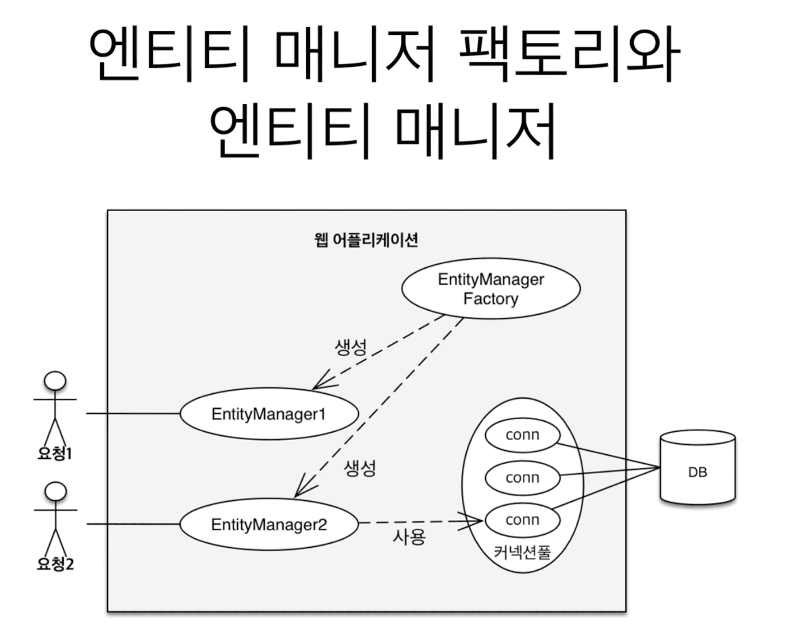
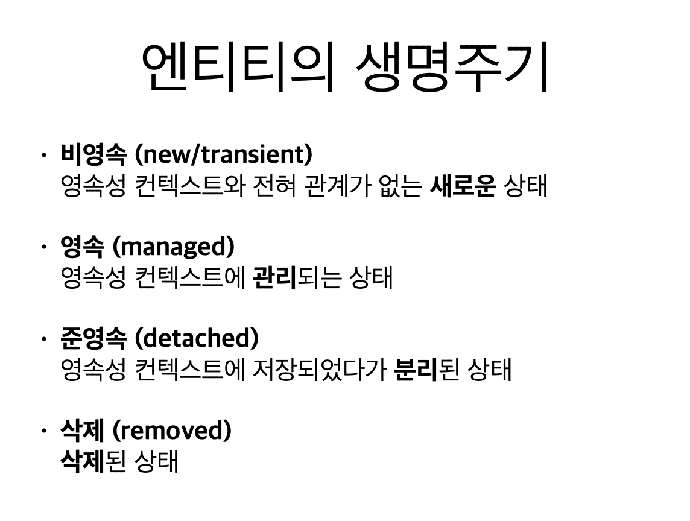
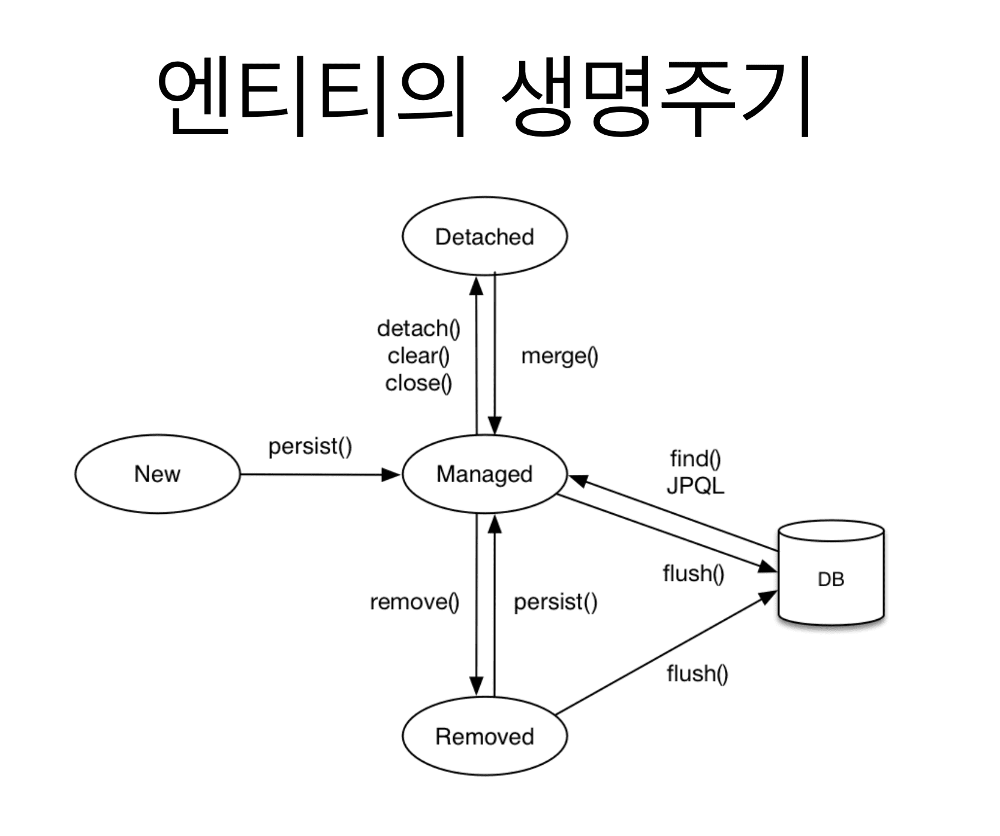
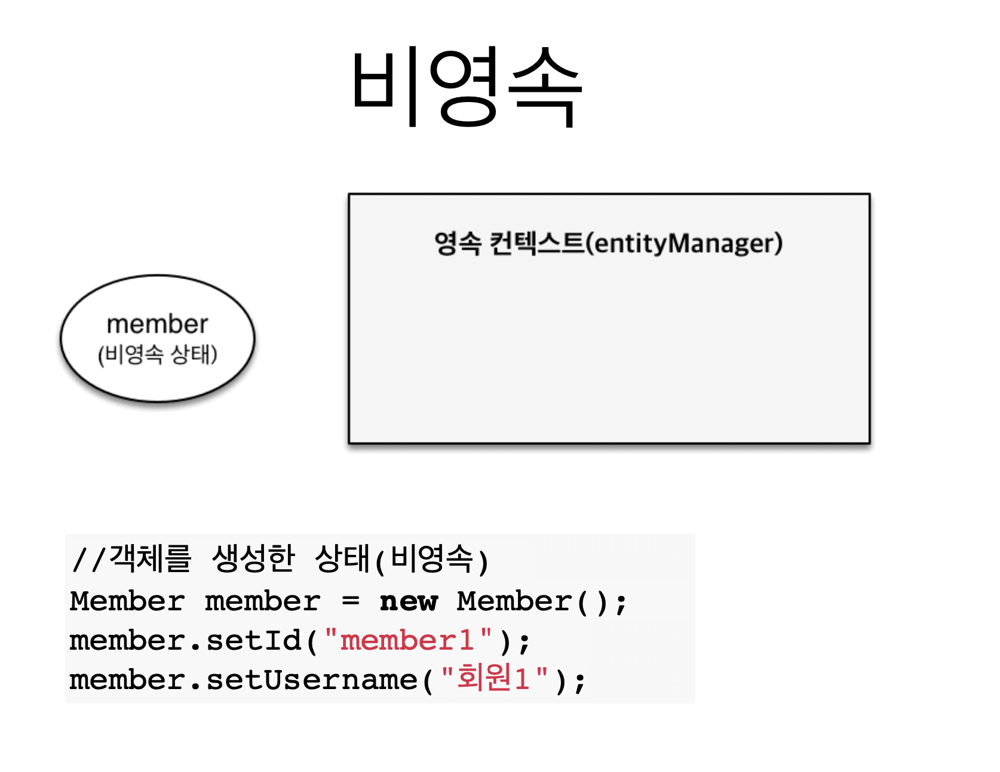
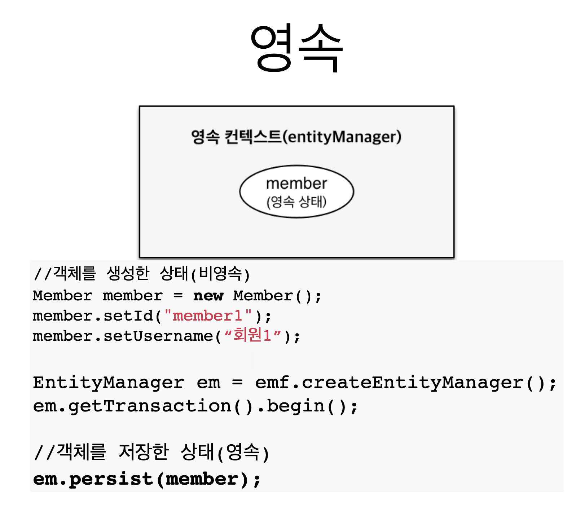
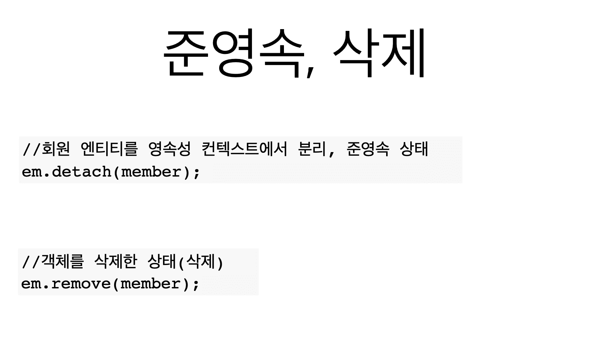
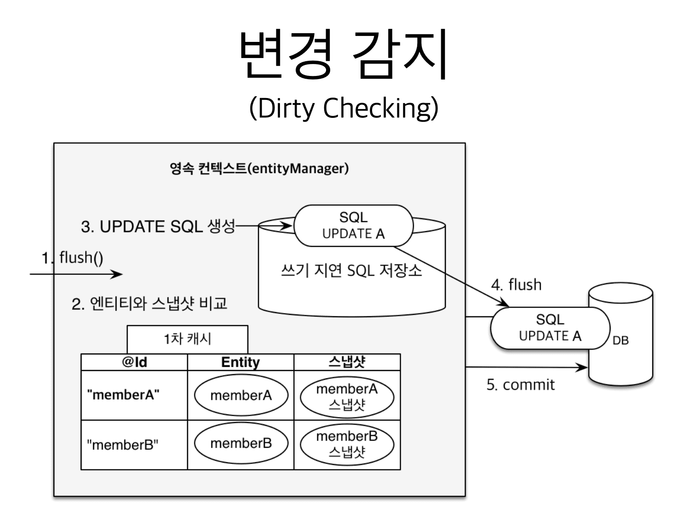

## 3. 영속성 관리 - 내부 동작 방식

### 3.1 영속성 컨텍스트 1

> 201001 (Thu)

* JPA에서 가장 중요한 포인트

    - **영속성 컨텍스트**

* EntityManagerFactory와 EntityManager (1:12)

* 영속성 컨텍스트 개념 (1:54)

    - 엔티티를 저장하는 환경이라는 뜻

    - 저장을 어디에 하느냐? 

      DB가 아니라 **영속성 컨텍스트**에 한다.

    - EntityManager를 통해서 영속성 컨텍스트에 접근한다.

* 엔티티의 생명주기

> 비영속

> 영속

> 준영속, 삭제

---

### 3.2 영속성 컨텍스트 2

> 201001 (Thu)

* 엔티티 조회, 1차 캐시 (00:00)

    - 조회 요청 시 1차 캐시에서 조회한다.

    - 1차 캐시는 1개의 Transaction에서만 유효하다.

      사실상 큰 메리트는 없다.

* 영속 엔티티의 동일성 보장 (07:53)

    - 1차 캐시로 **Repeatable Read 등급의 Isolation Level**을 

      DB가 아니라 Application에서 제공해준다.

* 변경 감지((= Dirty Check)) (21:18)

* 최초 DB에서 갖고온 데이터를 스냅샷으로 갖고있고

  transaction.commit()이 발생하면

  영속성 컨텍스트에 있는 객체와 스냅샷을 비교 후

  다르면 *쓰기 지연 SQL 저장소* 에 Update 쿼리를 자동으로 추가한다.

---

### 3.3 플러시

> 201001 (Thu)

* 플러시 

    - 영속성 컨텍스트의 변경내용을 DB에 반영

    - 영속성 컨텍스트를 플러시 하는 방법
    
        - em.flush() : 직접 호출
      
        - 트랜잭션 커밋 : 플러시 자동 호출 
      
        - JPQL 쿼리 실행 : 플러시 자동 호출

* Q. 플러시를 하면 1차 캐시가 다 지워지나요? (03:50)

  A. No

  1차 캐시는 유지된다.

  단지 쓰기 지연 SQL 저장소와 변경 감지가 이뤄져서 DB에 반영이 된다.

---

### 3.4. 준영속 상태

> 201001 (Thu)

* 준영속 상태로 만드는 법

1. em.detach(entity) : 특정 엔티티만 준영속 상태로 전환

2. em.clear() : 영속성 컨텍스트를 완전히 초기화

3. em.close() : 영속성 컨텍스트를 종료

---

### 3.5. 정리

> 201001 (Thu)

* Pass

