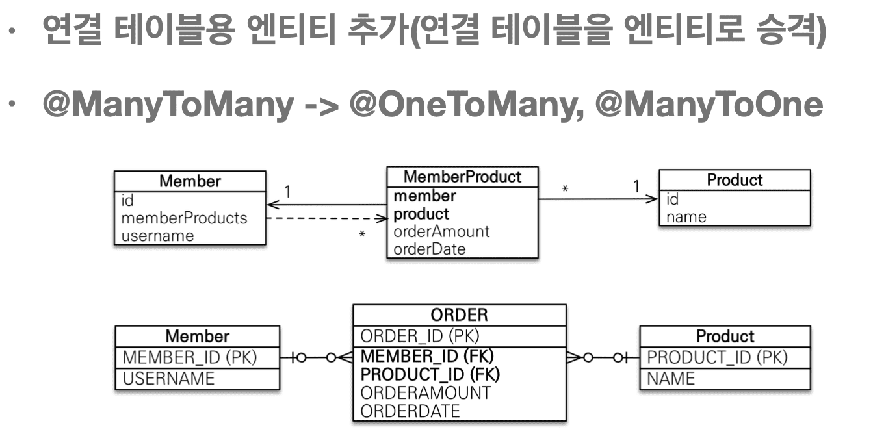

## 6. 다양한 연관관계 매핑

> 201002 (Fri)

### 6.1 다대일 [N:1]

> 201002 (Fri)

* Pass

* 이전 강의 복습 느낌으로 진행

---

### 6.2 일대다 [1:N]

> 201002 (Fri)

* 일대다 단방향 정리

    - 일대다 단방향은 일대다(1:N)에서 일(1)이 연관관계의 주인이다.

    - 테이블에서 1:N 관계는 항상 다(N)쪽에 외래키가 있다.

    - 객체와 테이블의 차이 때문에 

      반대편 테이블의 외래 키를 관리하게되는 특이한 구조를 갖게 된다.

    - **@JoinColumn**을 꼭 사용해야 한다. (11:33)

      그렇지 않으면 조인 테이블 방식을 사용한다.
    
      = 중간에 테이블을 하나 추가된다.

* 일대다 단방향 단점

    - 엔티티가 관리하는 외래 키가 다른 테이블에 있다.

    - 연관관계 관리를 위해 추가로 Update SQL이 실행되어야한다.

* Team 객체를 설정했는데 

  다른 Table인 MEMBER Table Update가 동작된다.

* 결론은 일대다 단방향 매핑보다는 **다대일 양방향 매핑**을 사용하자.

---

### 6.3 일대일 [1:1]

> 201002 (Fri)

* 일대일 관계는 그 반대도 일대일이다.

* 외래 키에 DB Unique 제약조건을 추가하는 구조를 갖게된다.

  A.b_id가 B.id(PK) 이므로

  A.b_id는 FK이면서 PK처럼 Unique 해야한다.

---
 
### 6.4 다대다 [N:M]

> 201002 (Fri)

* 실무에서는 사실 쓰면 안된다.

* **@JoinTable**을 사용한다.

* 다대다 한계 극복하는 방법 (07:44)

---

### 6.5 실전 예제 3 - 다양한 연관관계 매핑

> 201002 (Fri)

* Pass

---

