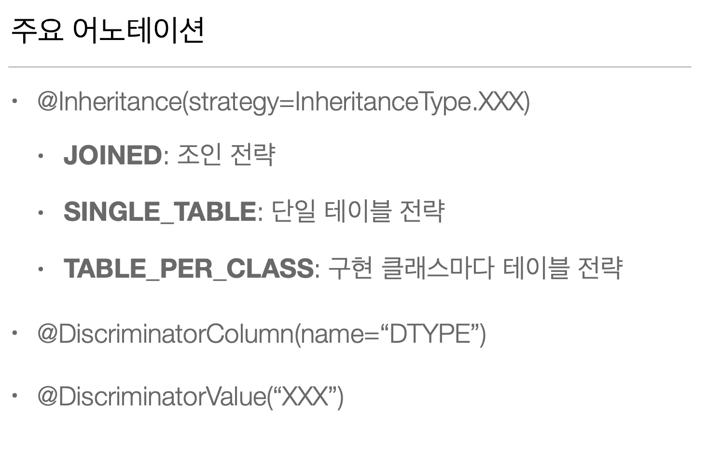
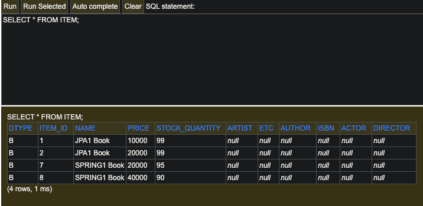
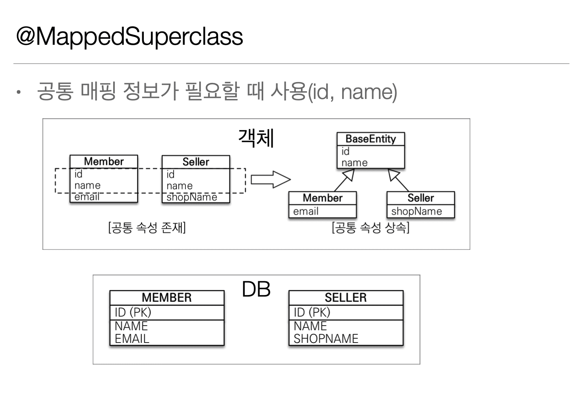

## 7. 고급 매핑

### 7.1 상속관계 매핑

> 201002 (Fri)



> **@Inheritance**

* Entity Name이 Default로 들어간다.

> **@DiscriminatorColumn**

* 부모 클래스에 선언한다. 

  하위 클래스를 구분하는 용도의 컬럼이다. 
  
* 관례는 default = DTYPE 이다.

  @DiscriminatorColumn(name = "CHILD_NAME") 이런식으로 작성하면

  DTYPE이 아니라 CHILD_NAME으로 컬럼이 생성된다.

* 그리고 컬럼 값은 DiscriminatorValue 설정이 없다면

  Default로 하위 클래스의 Entity Name이 들어간다.

> **@DiscriminatorValue**

* 하위 클래스에 선언한다. 

* 값을 설정하면 부모 클래스에서 DTYPE 컬럼의 값으로

  설정한 값이 들어간다. 

  따로 값 설정을 하지 않으면 Default로 Entity Name이 들어간다.
  
  
``` java
@Entity
@Getter
@Setter
@Inheritance(strategy = InheritanceType.SINGLE_TABLE)
@DiscriminatorColumn(name = "dtype")
public class Item {
  ...
}

@Entity
@Getter
@Setter
@DiscriminatorValue(value = "B")
public class Book extends Item {
  ...
}
```




---

### 7.2 Mapped Superclass - 매핑 정보 상속

> 201002 (Fri)



* 상속관계 매핑 개념과는 관련이 없다.

* Entity가 아니므로 Table 생성과 관련이 없다.

``` java
@MappedSuperclass
class A 
long id

class B extends A
String name
```

* 위와 같은 구조에서

  spring.jpa.hibernate.ddl-auto = create를 주더라도

  DB에서 B Table에는 모든 필드가 생성되지만

  A Table 자체가 생성되지는 않는다.

> DB Table

``` java
table B
long id
String name
```

* 검색이 불가하다. 

  ex) em.find(BaseEntity) // 불가능하다.

* Entity로 생성하여 영속성 관리를 할 필요가 없기 때문에 

  추상 클래스로 사용하는걸 권장한다.

  // 추상 클래스여도 @Entity가 있으면 DB 생성을 해준다. (02:34)

* 참고로 @Entity 클래스는 

  @Entity 혹은 @MappedSuperclass로 지정한 **클래스만** 상속이 가능하다.

---

### 7.3 실전 예제 4 - 상속관계 매핑

> 201002 (Fri)

* Pass

