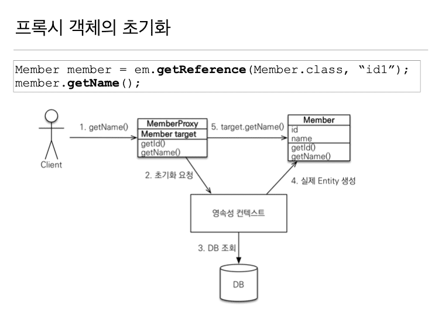
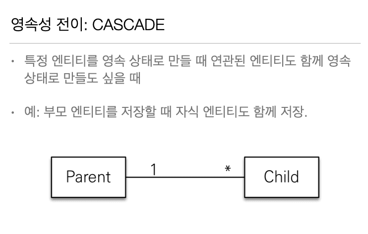
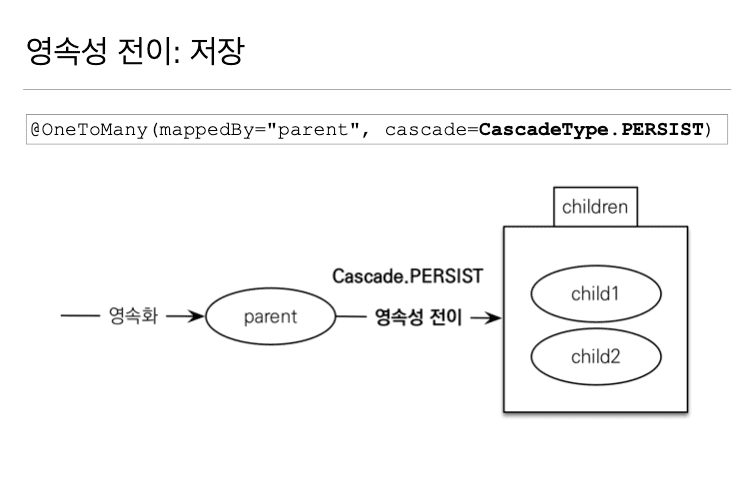
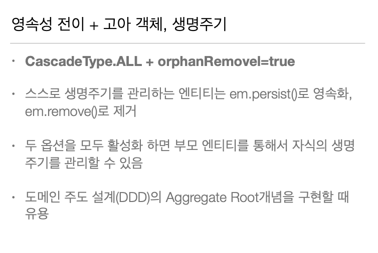

## 8. 프록시와 연관관계 관리

### 8.1 프록시

> 201002 (Fri)



* 영속성 컨텍스트가 DB에서 조회를 하고

  그 결과를 실제 Entity로 생성하고

  프록시는 target에 실제 Entity를 가리킨다.

  = 프록시 객체를 통해 실제 Entity에 접근한다.

<br>

* 프록시 객체는 원본 Entity를 상속 받는다.

  따라서 타입 체크 시 instanceof를 사용해야한다.

  ==를 사용하면 실패한다.

<br>

* 영속성 컨텍스트에 찾는 Entity가 이미 있으면 

  em.getReference( )를 호출해도 실제 Entity가 반환된다. 

  이미 영속성 컨텍스트에 있으므로 프록시로 만들어도 아무런 이점이 없다. (24:35)

<br>

* JPA는 타입의 동일성을 보장시켜준다. (30:38)

> Example

``` java
// Case 1
XXX a = em.find() --> 실제 Entity 반환
XXX b = em.getReference() --> 실제 Entity 반환

// Case 2
XXX a = em.getReference() --> Proxy 반환
XXX b = em.find() --> Proxy 반환

// Case 3
XXX a = em.getReference() --> Proxy 반환
XXX b = em.getReference() --> Proxy 반환
```

* a == b가 보장이 되어야한다.

  그러므로 JPA는 상황에 맞게 Class를 반환시킨다.

<br>

* 영속성 컨텍스트의 도움을 받을 수 없는 준영속 상태일 때

  프록시를 초기화하면 문제가 발생한다. (34:54)

> Example

``` java
1. XXX a = em.getReference( )
2. em.detach(a) or em.clear() or em.close()
3. a.getName() --> org.hibernate.LazyInitializationException 발생
```

* 프록시는 영속성 컨텍스트를 이용하는데

  2번에서 해당 프록시를 [준영속 상태](https://github.com/goodGid/Lecture/blob/master/inflearn/%EC%9E%90%EB%B0%94%20ORM%20%ED%91%9C%EC%A4%80%20JPA%20%ED%94%84%EB%A1%9C%EA%B7%B8%EB%9E%98%EB%B0%8D%20-%20%EA%B8%B0%EB%B3%B8%ED%8E%B8/Chapter_3.md#34-%EC%A4%80%EC%98%81%EC%86%8D-%EC%83%81%ED%83%9C)로 변경시켰기 때문에

  3번에서 해당 프록시에 접근하면 Exception이 발생한다.

<br>


---

### 8.2 즉시 로딩과 지연 로딩

> 201002 (Fri)

* 실제 로딩을 하는 시점은 값을 사용하는 시점이다.

``` java
1. Team team = member.getTeam();
2. team.getName();
```

* 2번에서 실제로 DB 조회가 이뤄진다.

<br>

* 가급적 지연 로딩만 사용해라. (09:20)

<br>

* 즉시 로딩은 JPQL에서 N+1 문제를 일으킨다. (11:40)

  만약 한번에 가져올 필요가 있으면 JPQL의 fetch join을 사용하자.

<br>

* Annotation Default Value

  One으로 끝나면 Eager

  Many로 끝나면 Lazy

```
@ManyToOne --> Eager
@OneToOne --> Eager
@OneToMany --> Lazy
@ManyToMany --> Lazy
```

---

### 8.3 영속성 전이(CASCADE)와 고아 객체

> 201002 (Fri)

* 영속성 전이와 고아 객체처리는 

  특정 Entity가 개인 소유할 때만 사용해야한다.

<br>

* 영속성 전이(CASACADE)





<br>

* 고아 객체 (12:30)

<br>

* 영속성 전이 + 고아 객체 2개다 설정 On 하였을 경우 (19:19)




---

### 8.4 설전 예제 5 - 연관관계 관리

> 201002 (Fri)

* Pass

