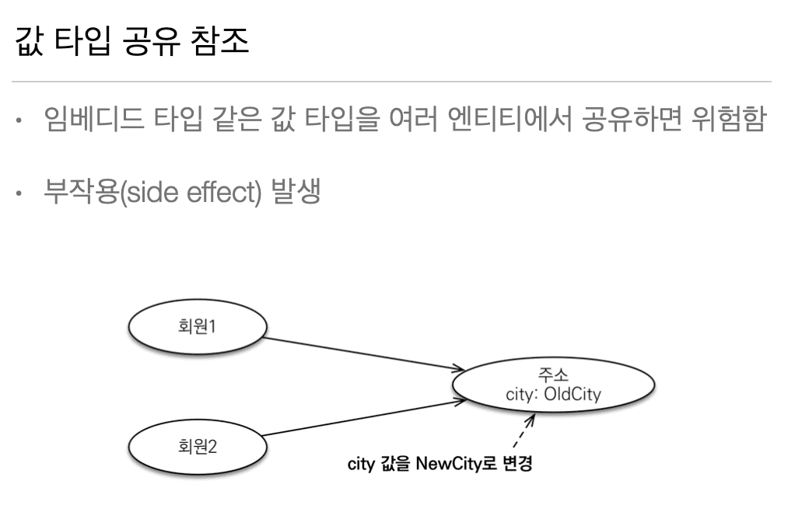
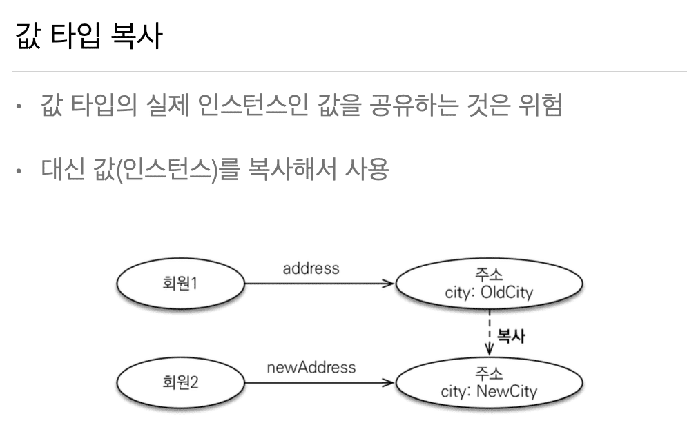
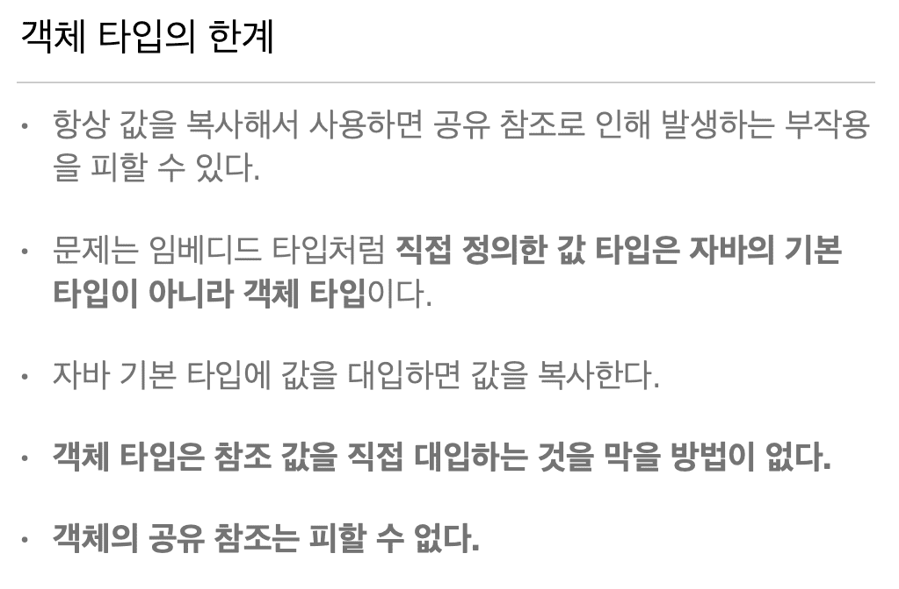

## 9. 값 타입

### 9.1 기본값 타입

> 201003 (Sat)

* Pass

---

### 9.2 임베디드 타입

> 201003 (Sat)

* Keyword

``` java
@Embeddable
@Embedded
@AttributeOverrides // 15:40
@AttributeOverride // 15:40
```

---


### 9.3 값 타입과 불변 객체

> 201003 (Sat)

* 값 타입은 불변 객체로 생성해야한다.

  자바 객체는 인스턴스를 공유해서

  같이 사용하면 의도치 않게 Side-Effect이 발생한다.

<br>
  


* 회원1이 city 값을 변경하면

  회원2의 city 값 또한 같이 변경이 된다.

  코드로 표현하자면 다음과 같다.

``` java
City city = new City("xxx");
member1.setCity(city)
member2.setCity(city)

member1.getCity().setName("yyy");
```


<br>



* 그러므로 회원2에서 city 값을 사용하려한다면 다음처럼 사용해야한다.

``` java
City city1 = new City("xxx");
member1.setCity(city1)

City city2 = new City(city1.getName());
member2.setCity(city2)

member1.getCity().setName("yyy");
```

* 그렇지만 다음처럼 사용해도 컴파일은 성공하므로 항상 위험에 노출될 수 있다.

``` java
City city1 = new City("xxx");
member1.setCity(city1)

City city2 = new City(city1.getName());
member2.setCity(city1) // city2가 아닌 city1로 값 세팅
```

<br>

* 객체 타입의 한계 




``` java
// 기본 타입
int a = 10;
int b = a; // 기본 타입은 값을 복사한다.

// 객체 타입
Address a = new Address("Old");
Address a = b; // 객체 타입은 참조를 전달한다.
b.setCity("New");
```

* 위와 같은 객체 타입의 한계를 방지하려면

  객체 타입을 수정 할 수 없게 만들면 부작용을 **원천 차단**이 가능하다.

  즉 값 타입은 **불변 객체**(Immutable Object)로 설계한다.

  ex) Setter를 없앤다.

---

### 9.4 값 타입의 비교

> 201003 (Sat)

* Pass


---

### 9.5 값 타입 컬렉션

> 201003 (Sat)

* Keyword

``` java
@ElementCollection
@CollectionTable
```

* 값 타입 컬렉션은

  영속성 전이(Cascade) + 고아 객체 제거 기능을 필수로 가진다고 볼 수 있다.

<br>

> 값 타입 컬렉션의 제약사항

* Table에 id가 있으면 Entity 

  ID가 없으면 값 타입이라고 생각하면 된다.

  = **값 타입은 Entity와 다르게 식별자 개념이 없다.**

* 그러므로 값을 변경하면 추적이 어렵다.

  그래서 값 타입 컬렉션에 변경 사항이 발생하면
  
  주인 엔티티와 연관된 모든 데이터를 삭제하고 

  값 타입 컬렉션에 있는 현재 값을 모두 다시 저장한다.

* 그러므로 사용하는걸 추천하지 않는다.

  사용해야한다면 
  
  진짜 단순한 로직에서 사용해야한다.

  ex) Select Box로 [치킨, 피자] 선택하는 정도의 단순한 로직 

<br>

> 정리


* 값 타입은 정말 값 타입이라 판단될 때만 사용해야 한다.

* Entity와 값 타입을 혼동해서 

  Entity를 값 타입으로 만들면 안된다.

  식별자가 필요하고 지속해서 값을 추적, 변경해야 한다면 
  
  그것은 값 타입이 아닌 Entity로 사용해야한다.

---

### 9.6 실전 예제 6 - 값 타입 매핑

> 201003 (Sat)

* Pass


